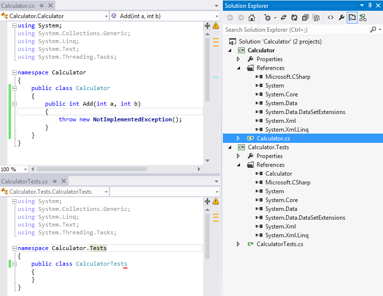
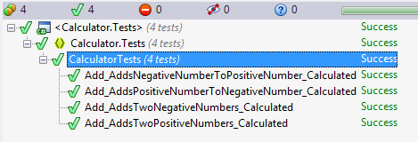

W tej części cyklu stworzymy nasz pierwszy test jednostkowy. Przedstawię krok po kroku jak napisać i przetestować prostą funkcjonalność wedle zasad TDD. Opiszę tutaj szczegółowo wszystkie kroki, począwszy od tego jak dodać referencję do NUnita, a skończywszy na tym jak uruchomić test. Zachęcam też do odwiedzenia ostatniej [części, która opisuje strukturę kodu jednostkowego Arrange-Act-Assert](/posts/kurs-tdd-3-struktura-test-czyli-arrange-act-assert/) "Kurs TDD część 3: Struktura testu, czyli Act-Arrange-Assert").

Zachęcam tym bardziej, że rozszerzyłem tę część o garść istotnych informacji. Za przykład posłuży nam klasa kalkulatora i metoda służąca do dodawania dwóch liczb. Przyjmijmy, że wymagania precyzują, że metoda ta przyjmuje dwa parametry wejściowe typu _int_ i zwraca wartość też typu _int_. Nasza funkcjonalność wygląda w kodzie następująco: 

```csharp
public class Calculator
{
    public int Add(int a, int b)
    {
        throw new NotImplementedException();
    }
}
```
 Pamiętamy, że w Test-Driven Development [testy piszemy w kroku pierwszym](http://dariuszwozniak.net/2013/04/20/kurs-tdd-czesc-1-wstep/ "Kurs TDD część 1: Wstęp"); dopiero później implementujemy kod i refaktoryzujemy.

# Ruszamy!

## Dodajemy solucję i projekty

Pierwszą czynnością po uruchomieniu Visual Studio jest utworzenie nowej solucji, dodanie projektów i zalążków naszych klas:

1.  Tworzymy nową solucję z projektem: _File > New > Project... > Class Library_ o nazwie: `Calculator`.
1.  Klasę `Class1.cs` zastępujemy klasą `Calculator.cs` i wklepujemy metodę Add, dokładnie taką jak powyżej.
1.  Dodajemy bibliotekę z testami do projektu: _File > Add > New Project... > Class Library_ o nazwie: `Calculator.Tests`.
1.  Dodajemy do projektu `Calculator.Tests` klasę o nazwie `CalculatorTests`.
1.  Dodajemy referencję projektu Calculator do projektu `Calculator.Tests`. (prawy klik na projekt _Calculator.Tests > Add Reference... > Projects >_ ✅ _Calculator_)

Zwróć uwagę na nazewnictwo projektu i klas. Nieformalna zasada mówi, że projekt z testami powinien mieć przyrostek _.Tests_, natomiast klasa zawierająca testy przyrostek _Tests_. Jeśli wszystko poszło dobrze, całość powinna wyglądać tak:

[

## Dodajemy NUnit

Kolejnym krokiem jest dodanie biblioteki NUnit do naszego projektu. Możemy to zrobić na dwa sposoby. Jednym z nich jest ściągnięcie DLL-ki z oficjalnej strony. Ten krok jest niemal niezbędny dla tych, którzy nie mają zainstalowanego ReSharpera. Drugim sposobem jest dodanie referencji przez NuGet. Jeśli NuGet jest Ci obcy, polecam mimo wszystko ten krok, gdyż jest bajecznie łatwy i sporo szybszy.

Nie będę opisywać ręcznego dodawania biblioteki, gdyż jest to nie rekomendowany sposób pracy z bibliotekami zewnętrznymi

Komentarz: Pamiętaj, że prócz NUnita są też inne frameworki do testowania, np. MSTest dostarczany z Visual Studio lub xUnit.NET. NUnit jest jednak najpopularniejszy w swojej dziedzinie.

### Dodajemy referencję przez NuGet

1.  Odpalamy NuGet w Visual Studio: _Tools > Library Package Manager > Package Manager Console._
1.  W oknie Package Manager Console ustawiamy domyślny projekt (_Default project_) `CalculatorDemo.Tests`.
1.  W tym samym oknie wpisujemy **Install-Package NUnit**.
1.  Jeśli wszystko się powiedzie, to dostaniemy komunikat: _Successfully added 'NUnit (wersja NUnita)' to CalculatorDemo.Tests._

Alternatywnie, jeśli nie chcemy instalować biblioteki z linii komend, a wolimy UI, to w oknie Solution Explorer można kliknąć prawym przyciskiem myszy na opcję Manage NuGet Packages i zainstalować NUnita z zakładki _Browse_.

### Dodajemy adapter

Jeśli nie posiadamy ReSharpera, to należy dodać do projektu bibliotekę NUnit3TestAdapter.

## Etap red: Piszemy testy

Pierwszym etapem [cyklu red-green-refactor](/posts/kurs-tdd-1-wstep/ "Kurs TDD część 1: Wstęp") jest faza _red_, czyli napisanie testów do jeszcze nieistniejącej funkcjonalności. Przed napisaniem testów jednostkowych musimy zastanowić się m.in. nad wszystkimi sytuacjami wyjątkowymi oraz wartościami brzegowymi. Nasz przypadek dodawania jest ekstremalnie łatwy. Nie oczekujemy wystąpienia wyjątku, nie mamy do czynienia z wartościami NULL ani pustymi stringami, nie mamy też zdarzeń, typów generycznych ani zależności do innych klas. Jakie przypadki możemy więc sprawdzić? Jako, że dodajemy do siebie dwie liczby typu _int_, możemy zrobić testy jednostkowe do następujących przypadków:

*   dodanie dwóch liczb dodatnich, np. 2 + 2 = 4,
*   dodanie liczby dodatniej do ujemnej, np. 2 + (-3) = -1,
*   dodanie liczby ujemnej do dodatniej, np. -2 + 3 = 1,
*   dodanie dwóch liczb ujemnych, np. -2 + (-2) = -4.

Taki zestaw testów zostanie przygotowany do naszej metody `Add`. Jeśli wszystkie testy przejdą pozytywnie, uznamy że nasza funkcjonalność napisana jest poprawnie. Każdy test jednostkowy napisany w NUnit z punktu widzenia technicznego to publiczna metoda void z atrybutem `[Test]`.

I tyle! Bierzemy się zatem do napisania pierwszego testu jednostkowego. Jeszcze jedna kwestia – jaka jest konwencja nazewnictwa w świecie TDD? Jest wiele szkół nazewnictwa, najważniejsze jednak żeby nazwa testu zawierała w sobie informacje:

*   Co testujemy i jaki jest stan testu, oraz
*   Jaki jest oczekiwany rezultat.

Przykładowo, do parametrów metody CheckPassword, wprowadzamy poprawną nazwę użytkownika i hasło; oczekujemy, że metoda wróci w takim przypadku wartość true. Dla takiego przypadku nazwa testu jednostkowego może być następująca: _CheckPassword\_ValidUserAndPassword\_ReturnTrue_. Spójrzmy na początek tego rozdziału i cztery przypadki do naszej metody. Pamiętając o tym, że jeden test jednostkowy testuje jedną funkcjonalność, musimy stworzyć cztery testy jednostkowe, a co za tym idzie cztery metody. Reasumując całą dotychczasową wiedzę z naszego kursu, pierwszy test, test dwóch liczb dodatnich, będzie wyglądać następująco: 

```csharp
[Test]
public void Add_AddsTwoPositiveNumbers_Calculated()
{
    var calc = new Calculator();
    int sum = calc.Add(2, 2);
    Assert.AreEqual(4, sum);
} 
```
 Nazwa naszej klasy mówi nam o tym:

*   Co testujemy _(Add) —_ testujemy metodę Add
*   Co robimy (_AddsTwoPositiveNumbers_) — dodajemy do siebie dwie liczby dodatnie
*   Czego oczekujemy (_Calculated_) — oczekujemy, że wartości zostaną wyliczone (prawidłowo)

W powyższym przykładzie inicjalizujemy obiekt klasy `Calculator`. Następnie dodajemy dwie liczby i przypisujemy rezultat do zmiennej o nazwie `sum`. Najważniejszym krokiem jest jednak ostatnia linijka, w której sprawdzamy czy wartość tej sumy odpowiada wartości oczekiwanej.

Kolejne trzy testy jednostkowe możemy "napisać metodą copy-paste", zmieniając nazwę testu, parametry wejściowe metody oraz wartość oczekiwaną. Zaraz, ale co z czystym kodem (możemy przypisać wcześniej wartości zmiennych, np. `int expected = 4`), duplikacją kodu (możemy wyrzucić zmienną `calc` do składowych klasy), itd.?

Otóż świat TDD ma trochę inne prawa niż kod produkcyjny. Dozwolone jest nieprzypisywanie zmiennych (testujemy czy 2 + 2 = 4, nie potrzeba nam więc przypisywać te wartości do zmiennych). Testy jednostkowe powinny być atomiczne i zawierać jak najmniej elementów mogących spowodować bugi w... tak, tak — teście; dozwolona jest więc w naszym teście jednostkowym duplikacja kodu, unikać powinno się takich elementów jak instrukcje warunkowe, pętle, dziedziczenie. Oczywiście, możemy znaleźć następstwa od tej reguły, takie jak obszerny setup metody z wieloma zależnościami, niemniej jednak należy trzymać się ww. reguł w codziennym życiu z testami.

Mamy zatem cztery metody z niemal identycznym kodem, dlaczego więc nie użyć jednej metody `Add_AddsTwoNumbers_Calculated` i zawrzeć w niej czterech asertów, jeden za drugim?: 

```csharp
Assert.AreEqual(4, calc.Add(2, 2));
Assert.AreEqual(-1, calc.Add(2, -3));
Assert.AreEqual(1, calc.Add(-2, 3));
Assert.AreEqual(-4, calc.Add(-2, -2));
```

Takie rozwiązanie ma bardzo dużą wadę: Jeśli którakolwiek z tych asercji nie zostanie spełniona, cały test jednostkowy będzie czerwony. O ile NUnit pozwala sprawdzić, która asercja nie została spełniona i dlaczego, nam nie zależy na informacji która asercja została niespełniona, ale czy cały test się powiódł lub nie. Innymi słowy, musimy na podstawie nazwy testu wywnioskować, co poszło nie tak w naszym teście. Testując wiele elementów w jednym teście, nie jesteśmy jednoznacznie stwierdzić co poszło nie tak. Stąd też kluczowa reguła TDD mówiąca o tym, że powinniśmy testować zawsze jedną rzecz. Bardzo ważne są też nazwy naszych testów, przybierające z tych powodów niekiedy kosmicznie długie rozmiary.

### Jak uruchomić testy?

Testy możemy uruchomić wybierając z menu Visual Studio opcję _Test_ > _Run_ > _All Tests_ (warunkiem jest posiadanie NUnit3TestAdapter dołączonego do naszego projektu).

Jeśli mamy ReSharpera, możemy to zrobić na dwa różne sposoby:

1.  Sposób 1.: Klikamy prawym przyciskiem myszy na projekt `Calculator.Tests` i wybieramy _Run Unit Tests_, lub
2.  Sposób 2.: Klikamy w edytorze kodu na zielonożółte kółko przy teście i wybieramy _Run_.

Po uruchomieniu testów wszystkie testy będą czerwone: 


## Etap green: Implementacja kodu

W etapie _green_ piszemy wreszcie nasz kod. W naszym przypadku rocket science to nie jest, do naszej metody `Add` wrzucamy 

```csharp
return a + b;
```
 Po uruchomieniu testów, wszystkie testy zaświeciły się na zielono:



## Etap ostatni: Refaktoryzacja kodu

Nasz przykład jest tak prosty, że nie potrzebujemy nic ulepszać. Pamiętajmy jedynie, że ten etap jest tak samo ważny co dwa pozostałe. Po dokończonej refaktoryzacji, odpalamy na nowo wszystkie testy i sprawdzamy czy nasza refaktoryzacja nie wprowadziła błędu. Nie dotyczy to naszego przypadku, gdyż nic nie refaktoryzowaliśmy.

# Zakończenie

W podanym przykładzie chciałem skupić się głównie na pierwszym zetknięciu z NUnitem. Całość opisałem w najprostszych krokach w taki sposób, aby osoba początkująca z Visual Studio czy C# mogła swobodnie napisać kod wg TDD i uruchomić testy. Z tego względu wybrałem bardzo prosty przypadek – dodawanie dwóch liczb całkowitych.

W [następnej części](/posts/kurs-tdd-5-nasz-drugi-test-jednostkowy) przejdziemy do testowania innej funkcjonalności – dzielenia. Dzięki temu przyjrzymy się trochę innym aspektom TDD. Będziemy musieli przyjrzeć się przypadkowi dzielenia przez zero (oczekujemy na wystąpienie wyjątku), jak i operacjom zmiennoprzecinkowym. Zachęcam do zrobienia takiego przykładu w domu! :)