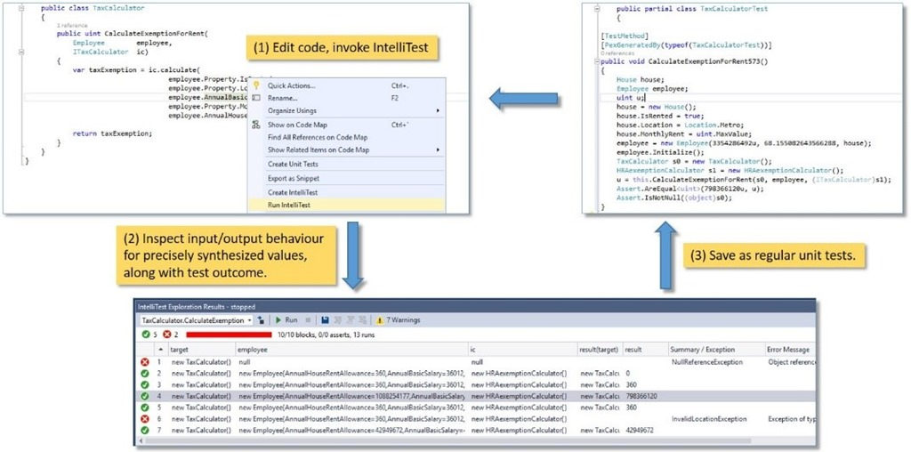
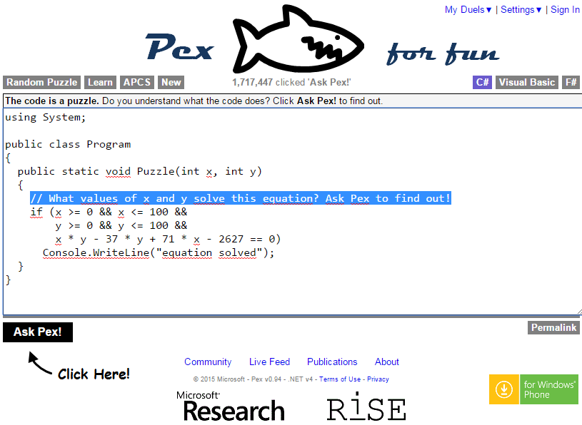
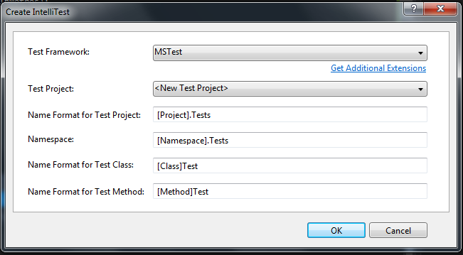

**IntelliTest** to wewnętrzna funkcjonalność Visual Studio (Enterprise 2015), która służy do generowania tabeli danych wejściowych oraz zestawu testów jednostkowych. Dla danej metody generowane są dane wejściowe, w oparciu których mogą zostać wygenerowane testy jednostkowe. Przypadki testowe tworzone są w oparciu o analizę każdego skoku warunkowego (_conditional branch_). Co więcej, tabela przypadków testowych zawiera scenariusze, które nie zostały obsłużone w naszej logice biznesowej, a które zwracają wyjątek (np. _NullReferenceException_ lub dzielenie przez zero). IntelliTest współpracuje natywnie z MSTest oraz poprzez rozszerzenia z xUnit.net i NUnit.   Źródło obrazka: [http://blogs.msdn.com/b/visualstudio/archive/2015/09/30/intellitest-for-net-test-more-with-less-effort.aspx](http://blogs.msdn.com/b/visualstudio/archive/2015/09/30/intellitest-for-net-test-more-with-less-effort.aspx)

# Historia projektu

Zanim powstał IntelliTest, Microsoft stworzył i przemianował kilka innych narzędzi:

## Pex (Visual Studio 2010)

Pex ([http://research.microsoft.com/en-us/projects/pex/](http://research.microsoft.com/en-us/projects/pex/)) to dziecko Microsoft Research, które posłużyło jako prototyp IntelliTestu. Visual Studio 2010 Power Tools zawiera dwa narzędzia do testowania: Pex i Moles. Pex generuje tablicę wartości we-/wyjściowych i pozwala na automatyczne stworzenie testów jednostkowych. (Moles zmienił nazwę Fakes; jest narzędzie do izolacji kodu.)

Pex dostępny jest w wersji online na stronie: [http://www.pexforfun.com/](http://www.pexforfun.com/) i jako aplikcja dla Windows Phone.

Wersja online zawiera samouczek (w tym samouczek języka C#/VB/F#), quizy do rozwiązania i coding duel.



## Code Digger (Visual Studio 2012, 2013)

Code Digger ([http://research.microsoft.com/en-us/projects/codedigger/](http://research.microsoft.com/en-us/projects/codedigger/)) to narzędzie z silniczkiem Peksa służącym do generowania testów dla PCL (Portable Class Libraries).

## Smart Unit Tests (pre-RC Visual Studio 2015)

Przed Release Candidate Visual Studio 2015, IntelliTest miało nazwę "Smart Unit Tests".

# **Przykład—Kalkulator BMI**

Aby zobrazować działanie IntelliTest, posłużmy się algorytmem wyliczającym BMI. Nasz kod bazowy wygląda następująco: 
```csharp
 public class BmiCalculator { public BmiKind Calculate(int massInKg, int heightInCentimetres) { decimal heightInMetres = heightInCentimetres / 100m; decimal bmi = massInKg / (heightInMetres * heightInMetres); if (bmi < 18.5m) return BmiKind.Underweight; if (bmi < 25) return BmiKind.Normal; if (bmi < 30) return BmiKind.Overweight; if (bmi >= 30) return BmiKind.Obese; throw new InvalidOperationException(); } } public enum BmiKind { Underweight = 0, Normal = 1, Overweight = 2, Obese = 3 } 
```
 W menu kontekstowym Visual Studio widnieją dwie opcje dla IntelliTest: Run i Create IntelliTest. 1. **Run IntelliTest** – Analiza przypadków dla danej metody/klasy, które otwiera okno "IntelliTest Exploration Results":  Powyższa analiza została uruchomiona na naszym kodzie wyliczającym indeks BMI. (Jako że IntelliTest gorzej radzi sobie z liczbami zmiennoprzecinkowymi, wzrost osoby podawana jest w centrymetrach, typ tej zmiennej to _int_.) W naszym przypadku analiza poradziła sobie bezproblemowo z wszystkimi przypadkami testowymi. Udało się pokryć logiczną zawartość naszej metody. IntelliTest wygenerował zestaw wartości, który zwraca każdą wartość enum _BmiKind_. Uwagi:

*   IntelliTest wskazał wartości wejściowe które nie zostały obsłużone w naszym kodzie. W tym przypadku jest to zestaw wartości (waga: 0 kg, wzrost: 0 cm), które prowadzą do wyrzucenia wyjątku _DivideByZeroException_.
*   Wyrzucenie wyjątku _InvalidOperationException_ w ostatniej linii metody _Calculate_ nie zostało pokryte, gdyż ten kod jest nieosiągalny.

Zobaczmy co się stanie jeśli wprowadzimy ograniczenia co zmiennych okreś. Wprowadźmy na początek metody warunki początkowe: 
```csharp
 const int MinMass = 40; // kg const int maxMass = 635; // kg if (massInKg <= MinMass || massInKg > maxMass) throw new ArgumentOutOfRangeException(); const int minHeight = 50; // cm const int maxHeight = 272; // cm if (heightInCentimetres <= minHeight || heightInCentimetres > maxHeight) throw new ArgumentOutOfRangeException(); 
```
 W wyniku otrzymamy następującą tabelę wartości we-/wyjścia:  W dalszym ciągu zestaw wartości wejściowych pokrywa się z każdą wartością _enum BmiKind_. Obsłużony został także przypadek dzielenia przez zero, stąd IntelliTest nie zwraca nam uwagi na ten problem. 2. Druga opcja to **Create IntelliTest** – Stworzenie automatycznych testów jednostkowych:  Przykładowy kod wygenerowany przez IntelliTest dla wartości wejściowych: masa = 41 kg, wzrost = 51 cm wraz z oczekiwanym rezultatem = BmiKind.Obese wygląda następująco: 
```csharp
 \[TestMethod\] \[PexGeneratedBy(typeof(BmiCalculatorTest))\] public void Calculate186() { BmiKind i; global::BmiCalculator.BmiCalculator s0 = new global::BmiCalculator.BmiCalculator(); i = this.Calculate(s0, 41, 51); Assert.AreEqual<BmiKind>(BmiKind.Obese, i); Assert.IsNotNull((object)s0); } 
```
 **Wnioski** Do czego w praktyce może przydać się IntelliTest? Można wyróżnić dwie dziedziny:

*   _Legacy code_: Dla zastanego kodu, IntelliTest można wykorzystać w celu automatycznego pokrycia kodu testami jednostkowymi. Główna zaleta takiego podejścia to oczywiście szybkość i pokrycie bez potrzeby refaktoryzacji. I jeśli chodzi o refaktoryzację, automatycznie wygenerowane testy dają nam pewien poziom bezpieczeństwa przed późniejszą refaktoryzacją i zmianami w kodzie _legacy_.
*   Nowy kod: IntelliTest ma dwie zasadnicze wady. Po pierwsze, wygenerowany kod nie jest idealny i ma sporo szumu. Po drugie, nie mamy gwarancji że pokrycie logiczne będzie równe 100%. W związku z tym dla nowo pisanego kodu narzędzie można wykorzystać do eksplorowania zachowań na podstawie danych we-/wyjściowych.

Przykład BMI obrazuje zachowanie IntelliTest dla dwóch parametrów wejściowych, ktróre są liczbą całkowitą. IntelliTest radzi sobie oczywiście też z innymi przypadkami, m.in. liczbami zmiennoprzecinkowymi, obiektami, pętlami, wyrażeniami regularnymi. Dla chcących sprawdzić sposób zachowania, polecam odwiedzenie wyżej wspomnianego Pex for Fun: [http://pexforfun.com/](http://pexforfun.com/).

# **Linki do rozszerzeń**

*   NUnit Extension: [https://visualstudiogallery.msdn.microsoft.com/bd30bf3f-4183-4b00-a245-1875316b8cd3](https://visualstudiogallery.msdn.microsoft.com/bd30bf3f-4183-4b00-a245-1875316b8cd3)
*   xUnit.net Extension: [https://visualstudiogallery.msdn.microsoft.com/bf74d890-a81e-4e49-beb7-1ad3a4e012af](https://visualstudiogallery.msdn.microsoft.com/bf74d890-a81e-4e49-beb7-1ad3a4e012af)

# **Źródła**

*   Generate unit tests for your code with IntelliTest ([https://msdn.microsoft.com/en-us/library/dn823749.aspx](https://msdn.microsoft.com/en-us/library/dn823749.aspx))
*   IntelliTest for .NET - Test More with Less (effort) ([http://blogs.msdn.com/b/visualstudio/archive/2015/09/30/intellitest-for-net-test-more-with-less-effort.aspx](http://blogs.msdn.com/b/visualstudio/archive/2015/09/30/intellitest-for-net-test-more-with-less-effort.aspx))
*   Pex and Moles - Isolation and White box Unit Testing for .NET ([http://research.microsoft.com/en-us/projects/pex/](http://research.microsoft.com/en-us/projects/pex/))
*   Code Digger ([http://research.microsoft.com/en-us/projects/codedigger/](http://research.microsoft.com/en-us/projects/codedigger/))
*   Introducing Smart Unit Tests ([http://blogs.msdn.com/b/visualstudio/archive/2015/09/30/intellitest-for-net-test-more-with-less-effort.aspx](http://blogs.msdn.com/b/visualstudio/archive/2015/09/30/intellitest-for-net-test-more-with-less-effort.aspx))