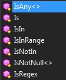
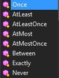

W tym artykule przyjrzymy się ciut bardziej zaawansowanym technikom tworzenia atrap przy pomocy **Moq**:

*   argument matching,
*   verify,
*   callback.

Wszystkie przykłady zostaną zaprezentowane przy użyciu Moq, jednak konkurencyjne frameworki niewiele się różnią w tym zakresie.

Aby zobrazować przykład wykorzystania "argument matcherów", weryfikacji i "callbacków" stwórzmy klasę `CustomerRepository`, która posiada metodę Add przyjmującą obiekt klasy implementującej interfejs `ICustomer` (lub w skrócie: klient). Jeśli walidacja przejdzie poprawnie, to klient zostanie dodany do kolekcji `AllCustomers` w klasie repozytorium. Interfejs repozytorium wygląda następująco: 

```csharp
 public interface ICustomerRepository
{
    IReadOnlyList<ICustomer> AllCustomers { get; }
    bool Add(ICustomer customer);
}
```

Konstruktor klasy implementującej interfejs `ICustomerRepository` pozwala na wstrzyknięcie walidatora interfejsu `ICustomerValidator`: 

```csharp
 public CustomerRepository(ICustomerValidator customerValidator) 
```

 Pełny kod repozytorium jest podany na końcu wpisu. Zachęcam jednak do tworzenia logiki biznesowej wraz z testami przy użyciu TDD i podanych scenariuszy, które pojawiają się sukcesywnie w tym wpisie.

# Argument Matching

Do tej pory mockowanie metody było znacznie ułatwione, gdyż żadna testowana metoda nie posiadała parametru. Co w przypadku, gdy mockowana metoda je jednak posiada posiada? W Moq, aby zdefiniować parametry metody, możemy posłużyć się tzw. _argument matching_ (z ang. "dopasowanie argumentów"). Dostępne są następujące "matchery":



## `It.IsAny`

Matcher `It.IsAny` możemy wykorzystać, gdy musimy przekazać zadany typ obiektu, który nie może być null-em, ale jednocześnie nie przejmując się tym co jego właściwości lub metody mogą zwrócić.

Jako pierwszy test jednostkowy, zdefiniujmy scenariusz w którym:

- Do repozytorium dodawany jest obiekt klasy implementującej interfejs `ICustomer` (czyt. dodajemy klienta do repozytorium).
- Walidacja nie przechodzi (`ICustomerValidator.Validate` zwraca fałsz).
- Asercja: Lista `AllCustomers` pozostaje pusta. `ICustomerValidator.Validate` przyjmuje jako parametr interfejs `ICustomer`. W naszym przypadku chcemy przekazać wartość nie-null-ową, a przy tym właściwości tej klasy mogą być dowolne. Przy tworzeniu atrapy dla walidatora, możemy posłużyć się matcherem `It.IsAny`: 

```csharp
 var customerValidatorMock = 
  Mock.Of<ICustomerValidator>(validator => 
    validator.Validate(It.IsAny<ICustomer>()) == false); 
```

 Pełny kod testu wygląda tak: 

```csharp
[Test]
public void WhenTryingToAddCustomerThatIsNotValidated_ThenCustomerIsNotAdded()
{
    var customerValidatorMock = 
      Mock.Of<ICustomerValidator>(validator =>
        validator.Validate(It.IsAny<ICustomer>()) == false);
 
    var customerRepository = new CustomerRepository(customerValidatorMock);
 
    customerRepository.Add(It.IsAny<ICustomer>());
 
    customerRepository.AllCustomers.Should().BeEmpty();
}
```

## `It.Is`

Matcher `It.Is` pozwala na definicję wartości zwracanych dla danego obiektu. Wartości zwracane są przekazywane jako parametr `It.Is`, który jest typu `Expression<Func<TValue, bool>>`. Możemy przyjąć więc dowolne warunki do spełnienia przez nasze atrapy.

Dla zobrazowania tego matchera, napiszmy test jednostkowy który testuje taki scenariusz:

- Chcemy dodać do repozytorium dwóch klientów, jednego z imieniem John, a drugiego z innym, dowolnym imieniem. Dla Johna walidacja przejdzie, dla drugiej osoby jednak nie.
- Asercja: Sprawdź czy tylko osoba z imieniem "John" została dodana do repozytorium.

Atrapa walidatora będzie wyglądać tak: 

```csharp
var customerValidatorMock =
  Mock.Of<ICustomerValidator>(validator =>
    validator.Validate(It.Is<ICustomer>(customer =>
      customer.FirstName == "John")) == true);
```

 Natomiast cały test: 

```csharp
[Test]
public void WhenTryingToAddMultipleCustomers_ThenOnlyValidatedOnesAreAdded()
{ 
    var customerValidatorMock =
      Mock.Of<ICustomerValidator>(validator =>
        validator.Validate(It.Is<ICustomer>(customer =>
          customer.FirstName == "John")) == true);
 
    var customerRepository = new CustomerRepository(customerValidatorMock);
 
    customerRepository.Add(Mock.Of<ICustomer>(customer =>
      customer.FirstName == "John"));

    customerRepository.Add(Mock.Of<ICustomer>(customer =>
      customer.FirstName == "NotJohn"));
 
    customerRepository.AllCustomers.Should()
      .HaveCount(1)
      .And.OnlyContain(customer => customer.FirstName == "John");
}
```

## `It.IsIn`, `It.IsInRange`, `It.IsRegex`

Matcher `It.IsIn` sprawdza czy porównywana wartość występuje na liście zdefiniowanych wartości, np.: 

```csharp
 mock.Setup(x => x.HasInventory(It.IsIn(1, 2, 3))).Returns(false); 
```

 Matcher `It.IsInRange` sprawdza czy zadana wartość jest w podanym zakresie, np.: 

```csharp
 mock.Setup(foo => foo.Add(It.IsInRange<int>(0, 10, Range.Inclusive))).Returns(true); 
```

 I, jak się można domyślać, matcher regeksowy sprawdza poprawność względem wyrażenia regularnego, np.: 

```csharp
 mock.Setup(x => x.DoSomething(It.IsRegex("\[a-d\]+", RegexOptions.IgnoreCase))).Returns("foo"); 
```

# `Verify`

Każdy mock stworzony przy pomocy Moq rejestruje historię wywołań oraz przypisania metod i właściwości wraz z przekazywanymi parametrami. Możemy więc sprawdzić powiązania między obiektami / interfejsami w naszej logice biznesowej. Skoro Moq rejestruje zdarzenia naszej atrapy, to możemy też sprwadzić ile razy dana metoda lub właściwość została wywołana lub przypisana. Do tego służy statyczna klasa `Times`:



Dla zobrazowania przykładu, posłużmy się następującym scenariuszem:

- Dodajemy do repozytorium klienta.
- Asercja: Sprawdzamy czy metoda Validate została wykonana. Ilość wywołań = jeden.

Ostatecznie, nasz test wygląda tak: 

```csharp
[Test]
public void WhenAddingCustomer_ThenValidateMethodOfValidatorIsCalledOnce()
{
    var customerValidatorMock = new Mock<ICustomerValidator>();
 
    var customerRepository = new CustomerRepository(customerValidatorMock.Object);
 
    customerRepository.Add(Mock.Of<ICustomer>(customer => customer.FirstName == "John"));
 
    customerValidatorMock.Verify(x => x.Validate(It.IsAny<ICustomer>()), Times.Once);
}
```

 Jeśli chcemy zweryfikować zdarzenie względem atrapy stworzonej w sposób funkcyjny (`Mock.Of<>`), to musimy naszą atrapę otoczyć metodą `Mock.Get`: 

```csharp
 Mock
  .Get(customerValidatorMock)
  .Verify(validator =>
    validator.Validate(It.Is<ICustomer>(customer =>
      customer.FirstName == "John")), Times.Once); 
```

 Jedną z olbrzymich zalet Moq są komunikaty przy niespełnionych asercjach ("niespełnione asercje", świetny pomysł na książkę fabularną :)). Przykładowo: jeśli w powyższym scenariuszu, w miejsce `Times.Once` wpiszemy `Times.Exactly(2)` to otrzymujemy wiadomość:
 
 

# `Callback`

Metoda `Callback` służy do radzenia sobie z tworzeniem atrap, w których chcemy zdefiniować jej... zachowanie. Przykład zastosowania — chcemy zliczyć ilość wywołań metody Validate. Możemy posłużyć się wyżej wymienionym `Verify`, ale możemy sobie poradzić sami korzystając właśnie z metody `Callback`: 

Scenariusz:

- Chcemy dodać do repozytorium dwóch klientów.
- Asercja: Sprawdzamy czy metoda `Validate` naszego walidatora została wykonana dokładnie dwa razy. 

```csharp
[Test]
public void WhenAddingTwoCustomers_ThenValidateMethodIsCalledTwoTimes()
{
    int called = 0;
 
    var customerValidatorMock = new Mock<ICustomerValidator>();
    customerValidatorMock.Setup(validator => validator.Validate(It.IsAny<ICustomer>()))
                         .Returns(true)
                         .Callback(() => called++);
 
    var customerRepository = new CustomerRepository(customerValidatorMock.Object);
 
    customerRepository.Add(Mock.Of<ICustomer>(customer =>
      customer.FirstName == "John"));

    customerRepository.Add(Mock.Of<ICustomer>(customer =>
      customer.FirstName == "NotJohn"));
 
    called.Should().Be(2);
}
```
# Podsumowanie

*   "Argument matchers" to jedna z najsilniejszych broni frameworków do tworzenia atrap. Przy pomocy tej funkcjonalności jesteśmy w stanie w bardzo prosty i czytelny sposób przekazać informacje o parametrach. Opcjonalnie, możemy zweryfikować poprawność przekazanych parametrów przy pomocy weryfikacji.
*   "Verify" to sposób na sprawdzenie powiązań między modułami. Dobry framework potrafi rejestrować historię zdarzeń danej atrapy. Dzięki temu, jesteśmy w stanie dokładnie określić ich powiązania.
*   "Callback" służy do zdefiniowania sposobu zachowania naszej atrapy. Z reguły używa jej się w wyjątkowych sytuacjach.

# Kod repozytorium

Nasz finalny kod repozytorium `CustomerRepository` wygląda tak: 

```csharp
public class CustomerRepository : ICustomerRepository
{
    private readonly List<ICustomer> _allCustomers;
    private readonly ICustomerValidator _customerValidator;
 
    public IReadOnlyList<ICustomer> AllCustomers => _allCustomers.AsReadOnly();
 
    public CustomerRepository(ICustomerValidator customerValidator)
    {
        _allCustomers = new List<ICustomer>();
 
        _customerValidator = customerValidator;
    }
 
    public bool Add(ICustomer customer)
    {
        if (_customerValidator.Validate(customer))
        {
            _allCustomers.Add(customer);
            return true;
        }
 
        return false;
    }
}
```

 Przypominam, że kod źródłowy całego kursu TDD, jak i tego rozdziału jest dostępny na GitHubie: [https://github.com/dariusz-wozniak/TddCourse](https://github.com/dariusz-wozniak/TddCourse).

# Linki zewnętrzne

*   [Moq: Github](https://github.com/Moq/moq4)
*   [Moq: Quick start](https://github.com/Moq/moq4/wiki/Quickstart)

<!-- tdd-course-infobox-start -->
<div class="boxBorder">

<div style="text-align: center; font-size: 40px">Kurs TDD</div>

----

<div class="row">
<div class="column">

Część I: Testy jednostkowe – wstęp

1. [Wstęp do TDD](/posts/kurs-tdd-1-wstep/)
2. [Testy jednostkowe, a integracyjne](/posts/kurs-tdd-2-testy-jednostkowe-a-testy-integracyjne/)
3. [Struktura testu, czyli Arrange-Act-Assert](/posts/kurs-tdd-3-struktura-test-czyli-arrange-act-assert)
4. [Nasz pierwszy test jednostkowy](/posts/kurs-tdd-4-nasz-pierwszy-test-jednostkowy)
5. [Nasz drugi test jednostkowy](/posts/kurs-tdd-5-nasz-drugi-test-jednostkowy)
6. [Dobre i złe praktyki testów jednostkowych](/posts/kurs-tdd-6-dobre-i-zle-praktyki-testow-jednostkowych)
7. [Inicjalizacja i czyszczenie danych (SetUp i TearDown)](/posts/kurs-tdd-7-inicjalizacja-i-czyszczenie-danych-setup-i-teardown/)
8. [Testy parametryzowane](/posts/kurs-tdd-8-testy-parametryzowane)
9. [Testy kombinatoryczne i sekwencyjne](/posts/kurs-tdd-9-testy-kombinatoryczne-i-sekwencyjne)
10. [Teorie](/posts/kurs-tdd-10-teorie)
11. [Testowanie klas generycznych](/posts/kurs-tdd-11-testowanie-klas-generycznych)
12. [Classic vs. Constraint Assert Model](/posts/kurs-tdd-12-classic-vs-constraint-assert-model)
13. [Testowanie wywołań asynchronicznych (async await)](/posts/kurs-tdd-13-testowanie-wywolan-asynchronicznych-async-await)

</div>

<div class="column">

Część II: Atrapy obiektów

14. [Testowanie zależności – atrapy obiektów](/posts/kurs-tdd-14-testowanie-zaleznosci-atrapy-obiektow)
2. [Moq cz. 1 – Wstęp](/posts/kurs-tdd-15-wstep-do-moq)
3. Moq cz. 2 – Argument Matching, Verify, Callback
4. [FakeItEasy](/posts/kurs-tdd-17-fakeiteasy)
5. [NSubstitute](/posts/kurs-tdd-18-nsubstitute)
6. [Mock, stub, fake, spy, dummy](/posts/kurs-tdd-19-mock-stub-fake-spy-dummy)
7. [Mockowanie DateTime.Now, random, static, itp.](/posts/kurs-tdd-20-mockowanie-datetime-now-random-static-itp)
8. [Rodzaje frameworków do tworzenia atrap](/posts/kurs-tdd-21-rodzaje-frameworkow-do-tworzenia-atrap/)

Część III: Teoria

22. [Pokrycie kodu testami (Code Coverage)](/posts/kurs-tdd-22-pokrycie-kodu-testami-code-coverage/)
1. [Czy to się opłaca?](/posts/kurs-tdd-23-czy-to-sie-oplaca/)
1. [Czy pisać testy jednostkowe do istniejącego kodu (legacy code)?](/posts/kurs-tdd-24-czy-pisac-testy-jednostkowe-do-istniejacego-kodu-legacy-code/)
1. [Otwarte pytania](/posts/kurs-tdd-25-otwarte-pytania/)

</div>
</div>
</div>
<!-- tdd-course-infobox-end -->