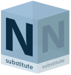

Pora przyjrzeć się trzeciemu najpopularniejszemu darmowemu frameworkowi, obok [Moq](/posts/kurs-tdd-15-wstep-do-moq) i [FakeItEasy](/posts/kurs-tdd-17-fakeiteasy), do tworzenia atrap w .NET – **NSubstitute**.



Co wyróżnia tę bibliotekę:

*   Główny nacisk położono na prostotę w semantyce. Składnia biblioteki ma w założeniu jak najbardziej przypominać naturalny język. Ilość wyrażeń lambda została zredukowana do minimum.
*   W Moq każda atrapa to _mock_, w FakeItEasy _fake_, a w NSubstitute... _substitute_ (z ang. "zamiennik"). Podobnie jak w dwóch wymienionych frameworkach, nie ma rozróżnienia na _mock, stub, fake, spy_, itp.

Dzięki temu, że biblioteka jest lekka, łatwa i przyjemna, doskonale nadaje się do celów edukacyjnych w temacie TDD i tworzenia atrap.

# Wstęp

Aby stworzyć atrapę w NSubstitute, należy skorzystać z metody `For` klasy `Substitute`: 

```csharp
 ICustomer customer = Substitute.For<ICustomer>(); 
```

 Przekazanie parametrów do konstruktora odbywa się przez ww. metodę `For`. W niej definiujemy wszystkie argumenty konstruktora: 

```csharp
 var customerValidator = Substitute.For<ICustomerValidator>();
 var customerRepository = Substitute.For<CustomerRepository>(customerValidator); 
```

 Zamienniki w NSubstitute tworzone są w trybie "loose". Dla przykładu: 

```csharp
 ICustomer customer = Substitute.For<ICustomer>();
 string firstName = customer.FirstName; // firstName = "" 
```

# Definicja zachowania

Zachowanie zamiennika można zdefiniować za pomocą metody rozszerzającej `Returns`: 

```csharp
 ICustomer customer = Substitute.For<ICustomer>();
 customer.GetAge().Returns(20); 
```

 Właściwości możemy definiować tak jak powyżej lub bezpośrednio przez dostęp do settera: 

```csharp
 ICustomer customer = Substitute.For<ICustomer>();
 customer.FirstName = "John";
 customer.FirstName.Returns("John"); // ekwiwalentne do powyższego 
```

 Aby wyrzucić wyjątek, korzystamy z metody `Throws`: 

```csharp
 ICustomer customer = Substitute.For<ICustomer>();
 customer.GetAge().Throws<NotSupportedException>(); 
```

 "Callback" możemy wykonać poprzez metodę `AndDoes`: 

```csharp
int a = 0;

ICustomer customer = Substitute.For<ICustomer>();

customer.GetAge()
  .Returns(20)
  .AndDoes(info => a++);

// a = 0

customer.GetAge();
// a = 1 
```

 Parametr metody `AndDoes` jest typu `Action<CallInfo>`, dzięki czemu mamy dostęp, dzięki klasie `CallInfo`, do argumentów przekazanych metodzie.

# Weryfikacja wywołań

Do zweryfikowania wywołania zamienników wykorzystuje się metodę `Received` oraz `DidNotReceive`: 

```csharp
var customerValidator = Substitute.For<ICustomerValidator>();
var customerRepository = new CustomerRepository(customerValidator);
 
var customer = Substitute.For<ICustomer>();
customer.FirstName = "John";
 
customerRepository.Add(customer);
 
customerValidator.Received().Validate(customer);
```

 `Received` przyjmuje opcjonalnie jako parametr ilość oczekiwanych wywołań.

# Argument Matching

"Argument matchery" działają w podobny sposób co w Moq i FakeItEasy. Parametry metody możemy przekazać bezpośrednio: 

```csharp
 calculator.Add(1, 2).Returns(3); 
```

 Lub, w przypadku złożonego dopasowania argumentów, za pomocą klasy `Arg` i metody `Any` oraz `Is`: 

```csharp
 calculator.Add(Arg.Any<int>(), Arg.Is<int>(i => i > 0)).Returns(1); 
```

# Podsumowanie

Sposób obsługi naszych atrap jest o wiele prostszy i czytelniejszy w stosunku do Moq i FakeItEasy. Semantyka jest do bólu prosta i nie pozostawia zbyt wielu domysłów czytelnikowi. Wykorzystanie lambd zostało zminimalizowane, przez co kod jest też łatwiejszy do zrozumienia dla początkujących programistów zaczynających przygodę z C# i TDD.

Do tej pory poznaliśmy trzy biblioteki do tworzenia atrap – [Moq](/posts/kurs-tdd-15-wstep-do-moq), [FakeItEasy](/posts/kurs-tdd-17-fakeiteasy) oraz NSubstitute. Wszystkie mają otwarty kod źródłowy i są darmowe. Warto poeksperymentować z nimi, aby wyrobić sobie opinię na temat każdej z nich. Ja osobiście nie mam faworyta w tej kwestii, uznałbym że wszystkie trzy zajmują ex aequo pierwsze miejsce. Różnica jest nieznaczna, gdyż wszystkie trzy oparte są na wzorcu proxy (na jednym z ich wariancie) i bibliotece Castle.Core.

Jest jeszcze kilka innych konkurentów na rynku, w tym płatnych i bardziej zaawansowanych. Nie będę ich jednak opisywać w tak szczegółowy sposób jak wyżej wymienione; niemniej jednak, temat powróci przy okazji omówienia typów bibliotek do tworzenia atrap i zaglądnięcia nieco pod maskę.

# Linki zewnętrzne

*   [NSubstitute: Strona internetowa](http://nsubstitute.github.io/)
*   [NSubstitute: Kod źródłowy](https://github.com/nsubstitute/nsubstitute)
*   [NSubstitute: Dokumentacja](http://nsubstitute.github.io/help.html)

<!-- tdd-course-infobox-start -->
<div class="boxBorder">

<div style="text-align: center; font-size: 40px">Kurs TDD</div>

----

<div class="row">
<div class="column">

Część I: Testy jednostkowe – wstęp

1. [Wstęp do TDD](/posts/kurs-tdd-1-wstep/)
2. [Testy jednostkowe, a integracyjne](/posts/kurs-tdd-2-testy-jednostkowe-a-testy-integracyjne/)
3. [Struktura testu, czyli Arrange-Act-Assert](/posts/kurs-tdd-3-struktura-test-czyli-arrange-act-assert)
4. [Nasz pierwszy test jednostkowy](/posts/kurs-tdd-4-nasz-pierwszy-test-jednostkowy)
5. [Nasz drugi test jednostkowy](/posts/kurs-tdd-5-nasz-drugi-test-jednostkowy)
6. [Dobre i złe praktyki testów jednostkowych](/posts/kurs-tdd-6-dobre-i-zle-praktyki-testow-jednostkowych)
7. [Inicjalizacja i czyszczenie danych (SetUp i TearDown)](/posts/kurs-tdd-7-inicjalizacja-i-czyszczenie-danych-setup-i-teardown/)
8. [Testy parametryzowane](/posts/kurs-tdd-8-testy-parametryzowane)
9. [Testy kombinatoryczne i sekwencyjne](/posts/kurs-tdd-9-testy-kombinatoryczne-i-sekwencyjne)
10. [Teorie](/posts/kurs-tdd-10-teorie)
11. [Testowanie klas generycznych](/posts/kurs-tdd-11-testowanie-klas-generycznych)
12. [Classic vs. Constraint Assert Model](/posts/kurs-tdd-12-classic-vs-constraint-assert-model)
13. [Testowanie wywołań asynchronicznych (async await)](/posts/kurs-tdd-13-testowanie-wywolan-asynchronicznych-async-await)

</div>

<div class="column">

Część II: Atrapy obiektów

14. [Testowanie zależności – atrapy obiektów](/posts/kurs-tdd-14-testowanie-zaleznosci-atrapy-obiektow)
2. [Moq cz. 1 – Wstęp](/posts/kurs-tdd-15-wstep-do-moq)
3. [Moq cz. 2 – Argument Matching, Verify, Callback](/posts/kurs-tdd-16-zaawansowane-techniki-moq-argument-matching-verify-callback)
4. [FakeItEasy](/posts/kurs-tdd-17-fakeiteasy)
5. NSubstitute
6. [Mock, stub, fake, spy, dummy](/posts/kurs-tdd-19-mock-stub-fake-spy-dummy)
7. [Mockowanie DateTime.Now, random, static, itp.](/posts/kurs-tdd-20-mockowanie-datetime-now-random-static-itp)
8. [Rodzaje frameworków do tworzenia atrap](/posts/kurs-tdd-21-rodzaje-frameworkow-do-tworzenia-atrap/)

Część III: Teoria

22. [Pokrycie kodu testami (Code Coverage)](/posts/kurs-tdd-22-pokrycie-kodu-testami-code-coverage/)
1. [Czy to się opłaca?](/posts/kurs-tdd-23-czy-to-sie-oplaca/)
1. [Czy pisać testy jednostkowe do istniejącego kodu (legacy code)?](/posts/kurs-tdd-24-czy-pisac-testy-jednostkowe-do-istniejacego-kodu-legacy-code/)
1. [Otwarte pytania](/posts/kurs-tdd-25-otwarte-pytania/)

</div>
</div>
</div>
<!-- tdd-course-infobox-end -->