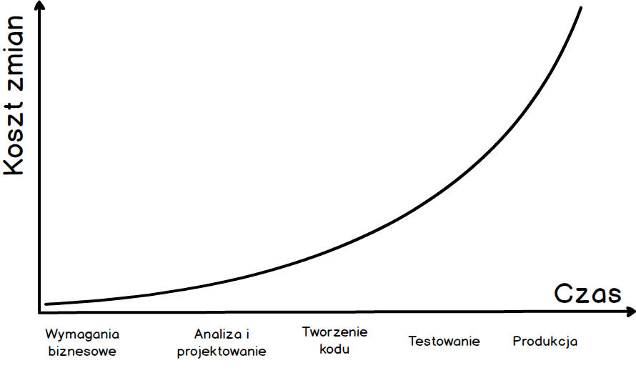
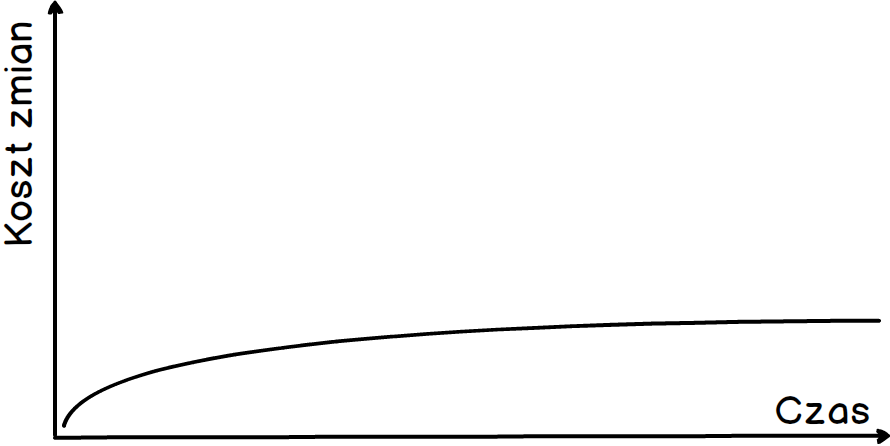

**Test-Driven Development** ma niezaprzeczalnie [bardzo pokaźną liczbę zalet](https://dariuszwozniak.net/2013/04/20/kurs-tdd-czesc-1-wstep/), jednak jednym z problemów stojących na przeszkodzie we wdrożeniu i stosowaniu tej techniki jest fakt, że pisanie testów jednostkowych wymaga większego nakładu czasowego programisty. Nie licząc czasu na zmianę sposobu myślenia oraz naukę zespołu, pisanie testów jednostkowych może trwać nawet dwukrotnie dłużej niż w sposób "beztestowy". Warto więc zadać podstawowe pytanie: Czy TDD się opłaca? Spójrzmy na TDD okiem biznesowym…

# Koszt zmian

Barry Boehm we wczesnych latach 80. ubiegłego wieku opublikował statystyki, z których wynikało że koszty zmian w oprogramowaniu oraz łataniu dziur w aplikacjach rosną w znaczący sposób z czasem życia programu. Analiza amerykańskich korporacji, m.in. Hewlett-Packard, IBM, Hughes Aircraft i TRW, wskazywała że cena zmian w oprogramowaniu rośnie wraz z przejściem do kolejnej fazy iteracyjnego modelu kaskadowego (tak, tak – _waterfall_):

*   Wymagania biznesowe
*   Analiza i projektowanie
*   Tworzenie kodu
*   Testowanie
*   Produkcja

Zmiana kodu po fazie analizy, tworzenia kodu, przetestowania go oraz oddaniu w ręce klienta może być nawet dwustukrotnie (!!) wyższa niż na etapie zbierania wymagań biznesowych. Oczywiście, wartość ta zależy od wielu czynników, takich jak na przykład wielkość i złożoność projektu. W pesymistycznym scenariuszu, koszt zmian rośnie wykładniczo. Zobrazujmy taki scenariusz przykładem: Jedna strona wymagań biznesowych może przełożyć się na 5 stron diagramów, 500 linii kodu, 15 stron dokumentacji oraz kilkadziesiąt przypadków testowych. W _waterfallu_ kaskadowane są zatem nie tylko fazy procesu, ale też problemy...  Koszt zmian w poszczególnych fazach projektu waterfallowego (na podst. _Extreme Programming Explained_  W jaki sposób możemy zredukować koszty zmian w projekcie programistycznym? W 1999 r. Kent Beck zaproponował spłaszczenie powyższego wykresu przy zastosowaniu autorskiej metody programowania ekstremalnego (XP). Składniki, które wpływają na elastyczność kodu i relatywnie niski koszt zmian to:

*   Zachowanie prostoty w kodzie i jego designie, w tym trzymanie się zasad KISS (_Keep It Simple Stupid_, „to ma być proste, głupku”) i YAGNI (_You Ain't Gonna Need It_, „nie będziesz tego potrzebować”).
*   Automatyczne testy, dzięki którym możemy mieć większą pewność, że nie wprowadzono błędu oraz możęmy znacznie zredukować czas pracy manualnych testów.
*   Dużo doświadczenia w ciągle zmieniającym się środowisku, głównie wymagań klienckich oraz designie kodu.

 Koszt zmian przy zastosowaniu programowania ekstremalnego jest znacząco mniejszy (na podst. _Extreme Programming Explained_

# Statystyki

Dobrze, mamy już oparcie o statystyki z waterfallowych lat 80. oraz przykład redukcji kosztów zmian przy pomocy paradygmatu ekstremalnego programowania. To jednak zbyt mało żeby jednoznacznie potwierdzić lub zaprzeczyć hipotezie o opłacalności TDD. Spójrzmy na problem z szerszej perspektywy.

## Microsoft i IBM

W roku 2008 pod marką Microsoft Research powstał eksperyment \[Nagappan\] mający na celu zbadanie zespołów z firmy IBM i Microsoft: czterech, które stosowały TDD oraz czterech z grupy kontrolnej, którą stanowiły zespoły jak najbardziej zbliżone do grupy eksperymentalnej, lecz oczywiście nie stosujące TDD. Eksperyment przeprowadzano na "żywych" projektach, aktualnie pisanych przez dane zespoły. Wszystkie cztery przypadki użycia dobrano w ten sposób, aby zagwarantować zróżnicowanie w obrębie eksperymentu. Zespoły miały:

*   Charakter kolokacyjny lub pracowały zdalnie.
*   Różny poziom doświadczenia programistów: od niskiego do wysokiego.
*   Różny poziom doświadczenia domenowego: od niskiego do wysokiego.
*   Różne języki programowania: Java, C++, .NET.
*   Różne rodzaje aplikacji: oprogramowanie sterowników, oprogramowanie systemowe, serwis webowy i zwykła aplikacja desktopowa.

Wnioski z eksperymentu były interesujące:

*   Zespoły TDD uzyskały znacząco mniej błędów: 40% mniej defektów miał zespół IBM oraz 60-90% zespoły Microsoftu.
*   Zespołom TDD zajęło 15-35% więcej czasu na napisanie kodu.
*   Bardzo ważnym aspektem w polepszeniu jakości okazało się tworzenie infrastruktury testów automatycznych—jednostkowych, integracyjnych i funkcjonalnych.
*   Zespoły, które kontynuowały stosowanie TDD po eksperymencie doświadczały niską ilość błędów na produkcji.
*   Ciekawa informacja od zespołu IBM: Po eksperymencie, niektórzy członkowie zespołu nie uruchamiali regresyjnych testów jednostkowych. Przyczyniło się to do wzrostu ilości defektów na produkcji.

## Mały projekt w parach

Do innego eksperymentu \[Boby\] zaproszono 24 doświadczonych programistów, którzy mieli napisać mały programik w Javie. Programowanie odbywało się w parach, gdzie jedna para pisała kod w oparciu o TDD, a druga (oczywiście) nie-TDD. Testy przeprowadzono w trzech różnych firmach. Do weryfikacji jakości przygotowano 20 testów penetracyjnych (black box). Okazało się, że:

*   Aplikacje programistów TDD spełniały średnio o 18% więcej przypadków testowych (w oparciu o testowanie black box) niż aplikacje z grupy kontrolnej.
*   Programiści TDD spędzili średnio o 16% dłużej czasu nad zadaniem. Przy czym każda grupa kontrolna została poproszona o napisanie testów jednostkowych po napisaniu swojego kodu, a tylko jedna uczyniła to w sposób "sensowny".
*   Po eksperymencie, 87,5% programistów uznało że TDD pomaga w lepszym rozumieniu wymagań biznesowych, zaś u 95,8% programistów TDD ułatwiło pracę przez zredukowanie czasu i energii na debugowanie.

## Meta-analiza

Jedną z najciekawszych prac nt. TDD jest meta-analiza 27 prac naukowych i 3 innych meta-analiz o tematyce TDD \[Rafique\]. Dokonano podziału prac naukowych ze względu na eksperymenty wykonane w środowisku akademickim oraz branżowym. Z ogólnie dostępnych prac naukowych odfiltrowano te, których wiarygodność była niska ze względu na:

*   Brak odpowiedniej ilości danych.
*   Brak grupy kontrolnej.
*   Brak zgodności co do realizowanego procesu (testowanie komponentów, testowanie w trakcie pisania kodu, a nie przed, itp.).

Nie rozpartywano także prac, w których wyniki opierały się o rezultaty już istniejących prac naukowych. Wyniki analizy przedstawiają się następująco:

*   Zespoły TDD z uzyskały wyższe wskaźniki jakościowe w stosunku do zespołów nie-TDD.
*   Różnica ta jest widoczna bardzo wyraźnie w przypadku projektów branżowych, gdzie w stosunku do projektów akademickich mamy do czynienia z większą ilością linii kodu, bardziej doświadczonymi programistami i większymi zadaniami.
*   Dla projektów branżowych, które posiadają 10'000 - 100'000 linii kodu poprawa jakości dla zespołów TDD waha się w granicach 35-90%.

# Podsumowanie

Czy TDD zawsze się opłaca? Wiemy z wielu wiarygodnych źródeł, że TDD łączy się z wyraźnie wyższą jakością a w rezultacie mniejszą ilość defektów. Narzut czasowy na napisanie testów jednostkowych szybko się zwraca, gdyż koszt późniejszych zmian bez automatycznych testów jest znacząco wyższy, a w pesymistycznych scenariuszach może rosnąć wykładniczo. TDD jest bardzo dobrze zbadany w językach obiektowych i tam zwrot z inwestycji dla projektów podparty jest dużo wyższą jakością. Brakuje jednak odpowiedniej ilości prac i przypadków użycia dla języków nieobiektowych oraz ekosystemów z wyłączną warstwą testów funkcjonalnych i BDD. Nic nie stoi jednak na przeszkodzie, aby opłacalność dodatkowych warstw testowych badać empirycznie na przykładzie swojego projektu. Z mojego doświadczenia i obserwacji wynika, że warstwę testów jednostkowych warto rozszerzyć (lub taką opcję rozważyć) o testy integracyjne, ATDD lub/i BDD.

# Źródła

*   Boby George, Laurie Williams, _An Initial Investigation of Test Driven Development in Industry_.
*   Kent Beck, _Extreme Programming Explained_.
*   Jim Bird, [_The Real Cost of Change in Software Development_](https://dzone.com/articles/real-cost-change-software).
*   Jim Bird, [_Architecture-Breaking Bugs – when a Dreamliner becomes a Nightmare_](http://swreflections.blogspot.com/2013/04/architecture-breaking-bugs-when.html).
*   Nachiappan Nagappan, E. Michael Maximilien, Thirumalesh Bhat, Laurie Williams, _Realizing quality improvement through test driven development: results and experiences of four industrial teams._
*   Steve McConnell, [_Software Quality at Top Speed_](http://www.stevemcconnell.com/articles/art04.htm).
*   Yahya Rafique, Vojislav B. Mišić, _The Effects of Test-Driven Development on External Quality and Productivity: A Meta-Analysis_.