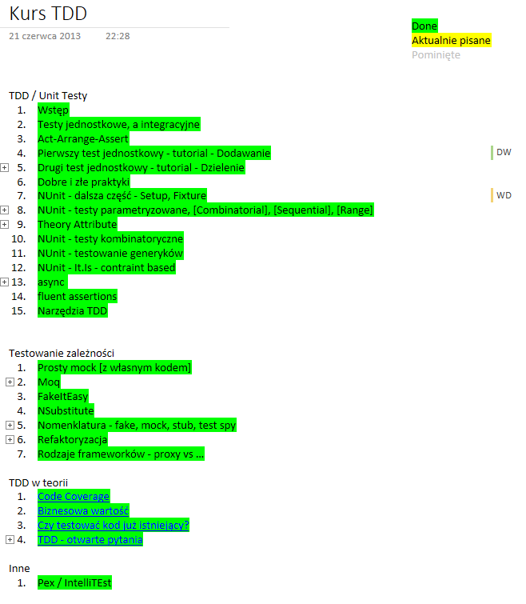
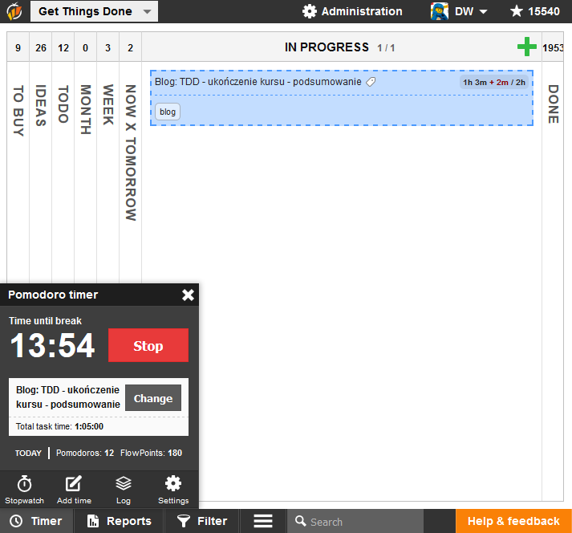

Minęło łącznie 1255 dni od [pierwszej części kursu TDD](/posts/kurs-tdd-1-wstep/) opublikowanego 20 kwietnia 2013…

Był to pierwszy post na tym blogu, a sam kurs miał dyktować kierunek tego bloga na najbliższe 2-3 lata. Kończąc cykl częścią 25. nadszedł czas na mini-podsumowanie kursu…

# Dlaczego napisałem ten kurs?

Problem jaki powstał przy mojej nauce TDD to przede wszystkim brak źródła informacji, który oprowadził by mnie od początku do końca po tematyce testów jednostkowych dla .NET. Owszem, było w tym czasie sporo źródeł, jednak wiedza oparta w tych źródłach była albo dostosowana pod inny język, albo nieaktualna (Rhino Mocks, MsTest), albo najzwyczajniej w świecie rozrzucona po blogach i StackOverflow. Było jest i sporo świetnych artykułów, które traktują TDD dla .NET, także w polskiej blogosferze, ale brakowało jednak poprowadzenia programisty, przysłowiowo, za rękę.

Pomyślałem, że taki kurs to świetne paliwo do bloga, zebrałem i zapisałem różne wycinki i magic - zacząłem pisać :) Moim zamiarem było stworzenie cyklu, który poprowadzi programistę przez ścieżkę nauki TDD – począwszy od napisania pierwszego testu jednostkowego, po mockowanie, aż po rozważania teoretyczne.

Sama tematyka to nic nowego w świecie programistycznym. I, jakby się mogło wydawać, nic też trudnego. W praktyce może to wyglądać jednak zupełnie inaczej. Istotną kwestią jest, prócz przygotowania merytorycznego, kultura zespołu i firmy. Jeżeli zatem brakuje czasu na setup i zrobienie porządków z unit testami, należałoby się zastanowić nad kulturą miejsca pracy. Z tego też powodu wysnułem kilka rozważań na temat kilku pułapek ([code coverage](/posts/kurs-tdd-22-pokrycie-kodu-testami-code-coverage/)), jak i podstawowego pytania – [czy to się w ogóle opłaca](/posts/kurs-tdd-23-czy-to-sie-oplaca/)?

# Za kulisami

Plan na kurs napisałem 3 lata temu i wyglądał następująco:

Od pewnego czasu zacząłem korzystać też z [KanbanFlow](https://kanbanflow.com/), estymując i mierząc czas spędzony na napisanie posta. Wyniki przedstawiają się następująco (czas podany w godzinach):

| Name | Time estimate (h) | Time spent (h) |
|-----|:-----:|:-----:|
| Blog: TDD – otwarte pytania | 2 | 0,617 |
| Blog: Czy testować kod już istniejący? | 3 | 2,805 |
| Blog: Biznesowa wartość TDD | 4 | 5,886 |
| Blog Post – Code Coverage | 2 | 1,791 |
| Blog Post 1: Rodzaje frameworków do mockowania – proxy vs… | 2 | 1,556 |
| Blog Post – 2 | 2 | 0,752 |
| Blog Post – 1 | 2 | 1,212 |
| Blog Post – #2: Jak przetestować DateTime, Random, itd. | 2,5 | 1,552 |
| Blog Post – #1: Nomenklatura – fake, mock, stub, test spy | 3 | 3,629 |
| Blog – FluentAssertions – fix | 0,083 | 0,196 |
| Blog post – NSubstitute | 2 | 1,453 |
| Blog Post: Fluent Assertions | 1,25 | 1,224 |
| Blog post – Teorie | 2 | 1,761 |
| Blog post – FakeItEasy | 2 | 2,118 |
| Blog – testy kombinatoryczne | 1,5 | 1,278 |
| Blog Post: IntelliTest | 2 | 3,288 |
| Lista frameworków TDD – github | 1 | 2,46 |
| Blog: Moq – argument matching, callback, verify | 2 | 2,793 |
| Blog Post – Moq | 2 | 4,432 |
| Blog: Prosty mock [z własnym kodem] | 4 | 3,901 |
| Blog Post #2: Resharper postfix | 2 | 0,281 |
| Blog Post #1: TDD i async await | 2 | 1,569 |
| Blog: Testy parametryzowane TDD | 2 | 4,016 |

Z tabeli wynika, że czas spędzony na napisanie jednego posta to mniej więcej 1–3 godz. To dużo? Nie, to cholernie mało. Jeśli ktoś rozważa założenie swojego bloga, ale boi się, że zeżre mu to zbyt wiele cennego czasu, to jest w błędzie. (Swoją drogą, polecam KanbanFlow do zarządzania własnym czasem. Przykładowy zrzut ekranu:)

# Czy to koniec kursu?

Tak, jest to koniec kursu z podstawowymi informacjami, które powinien znać każdy przy nauce podstaw TDD. Tematów do kursu było więcej, jednak odrzuciłem te które są mniej istotne. Jeśli będę o nich pisał, to wrzucę je do działu [Kurs TDD](https://dariuszwozniak.net/kurs-tdd/).

# Posłowie

Cieszy fakt, że cykl ten dotarł do wielu osób i pozwolił nauczyć bądź usystematyzować wiedzę z zakresu TDD. Co ważne, samo studiowanie tematu przyczyniło się też do tego, że dowiedziałem się o TDD sporo nowych rzeczy. Nic tak nie uczy jak przygotowanie do zrobienia prezentacji czy szkolenia, czy też właśnie napisanie posta na blogu. Zachęcam Cię więc czytelniku do rozważenia własnego bloga – to świetna metoda na naukę :)