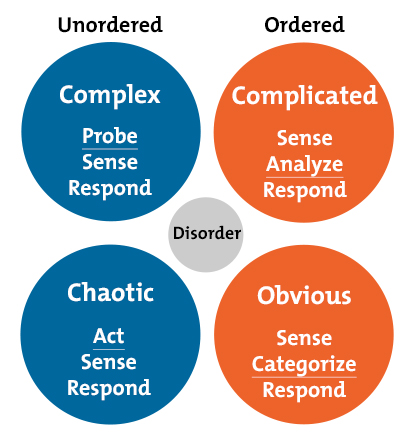

> _Hofstadter's Law: It always takes longer than you expect, even when you take into account Hofstadter's Law._

**Estymacja, czyli szacowanie projektu programistycznego** to bardzo często bolączka każdego zespołu. Czego użyć do szacowania naszego projektu:

*   estymat godzinowych,
*   roboczodniowych,
*   Story Pointów,
*   koszulkowych,
*   a może w ogóle nie korzystać z estymat (#NoEstimates)?

Postaram się przedstawić sposoby oraz zalety i wady każdej z tych metod estymacji, zaczynając od tego postu i estymat czasowych.

# Ludzka natura i błędy poznawcze

 

Źródło: [http://theincidentaleconomist.com/wordpress/planning-falacy/](http://theincidentaleconomist.com/wordpress/planning-falacy/)

Zacznijmy od tego, że nam ludziom bardzo trudno jest oszacować czas trwania zadania lub projektu programistycznego. Dlaczego? Ludzie są z reguły słabi w szacowaniu zadań. Laureat nagrody Nobla Daniel Kahneman wraz z Amosem Tverskym zaproponowali określenie "złudzenie planowania" (ang. _planning fallacy_). Zgodnie z ich teorią, planowanie czasowe danego zadania związane jest ze zbyt dużym optymizmem i niedoszacowaniem potrzebnego czasu na jego realizację. Związane to jest bezpośrednio z kilkoma czynnikami:

*   Planowanie z uwzględnieniem tylko i wyłącznie najbardziej optymalnego scenariusza dla rozwiązania zadania.
*   Myślenie życzeniowe, innymi słowy – ludzie są przekonani, że ukończą dane zadanie szybko i bez problemów.
*   Prawo Brooksa: dodanie nowej osoby (lub nowych osób) do opóźnionego projektu powoduje ryzyko jeszcze większego opóźnienia.
*   Efekt skupienia: przywiązanie zbyt dużej uwagi do jednego szczegółu, co w istocie zaburza racjonalną ocenę użyteczności rozważanego rozwiązania.
*   Dysonans poznawczy: wg Wikipedii - "stan nieprzyjemnego napięcia psychicznego, pojawiający się u danej osoby wtedy, gdy jednocześnie występują dwa elementy poznawcze (np. myśli i sądy), które są niezgodne ze sobą. Dysonans może pojawić się także wtedy, gdy zachowania nie są zgodne z postawami. Stan dysonansu wywołuje napięcie motywacyjne i związane z nim zabiegi, mające na celu zredukowanie lub złagodzenie napięcia."

Badania Standish Group z roku 2004 dla wykazały, że 71% projektów IT była niedoszacowana czasowo lub/i budżetowo, co według wyliczeń skutkuje stratami rzędu 55 miliardów USD w samych Stanach rocznie. Bent Flyvberk, ekspert ds. planowania, przeanalizował niemal 300 największych inwestycji publicznych na świecie - blisko 90% z nich było niedoszacowanych.

# Cynefin Framework

A jeśli spróbujemy ugryźć problem od strony bardziej technicznej? Spróbujmy odpowiedzieć na pytanie, jak wysoka jest złożoność projektów programistycznych. Dave Snowden zaproponował framework o nazwie "Cynefin" do określenia złożoności otaczającego nas świata. W ogromnym (podkreślam: ogromnym, gdyż Cynefin framework to temat na osobną książkę) uproszczeniu, wyróżniamy pięć domen określających stopień złożoności:

1.  **Oczywisty (obvious).** Do tej domeny możemy stosować najlepsze praktyki.
    1.  Domena uporządkowana (ordered).
    2.  Związek między przyczyną, a skutkiem jest oczywisty dla wszystkich.
    3.  Odczuj-Skategoryzuj-Zareaguj.
    4.  Bardzo dobrze znane oraz pewne praktyki.
    5.  Monitorowanie niezgodności i odchyleń od standardu.
2.  **Skomplikowany (complicated)**. Do tej domeny możemy stosować dobre praktyki.
    1.  Domena uporządkowana (ordered).
    2.  Relacja między przyczyną, a skutkiem wymaga analizy lub dogłębniejszej analizy eksperckiej.
    3.  Nie dla wszystkich ten związek jest oczywisty.
    4.  Możliwe, że istnieje wiele rozwiązań danego problemu.
    5.  Rozwiązanie możliwe do przewidzenia
    6.  Rozwiązanie: Odczuj-Analizuj-Zareaguj
3.  **Złożony (complex)**. Możemy stosować praktyki wyłaniające się, wschodzące.
    1.  Domena nieuporządkowana (unordered).
    2.  Związek między przyczyną, a skutkiem można doszukać się jedynie na podstawie danych historycznych. Istnieją różne, konkurujące ze sobą odpowiedzi.
    3.  Eksperymenty "safe-to-fail".
    4.  Rozwiązanie: Zbadaj-Odczuj-Zareaguj.
4.  **Chaos**. Możemy stosować całkowicie nowe praktyki.
    1.  Domena nieuporządkowana (unordered).
    2.  Bez związku przyczynoskutkowego na poziomie systemu.
    3.  Rozwiązanie: Działaj-Odczuj-Zareaguj.

Piąta domena, **nieporządek**, to stan w którym nie znamy rodzaju związku przyczyno-skutkowego. Priorytetem nr 1 jest odnalezienie jednej z powyższych domen. 

Źródło: [http://cognitive-edge.com/](http://cognitive-edge.com/)

Źródło: [http://sketchingmaniacs.com/decision-making/](http://sketchingmaniacs.com/decision-making/)

Do której domeny należy pisanie oprogramowania? I tu odpowiedź też nie jest prosta… Możemy rozróżnić rodzaje zadań i ich stopień złożoności charakterystycznych dla projektów programistycznych, np.: \[Pelrine\]

1.  Oczywisty:
    1.  Wiemy, kiedy zadanie zostanie ukończone.
    2.  Monitorujemy czas spędzony nad zadaniem.
    3.  Napisanie drobnej funkcjonalności.
2.  Skomplikowany:
    1.  Ambitny (polityczny) deadline.
    2.  Naprawa zepsutego builda.
    3.  Odnalezienie osoby kontaktowej ws. danego problemu.
3.  Złożony:
    1.  Zmieniające się wymagania.
    2.  Estymacja zadań.
4.  Chaos:
    1.  Debata na temat standardów kodowania.
    2.  Retrospektywy bez wniosków.
    3.  Zbyt duży projekt.
5.  Nieporządek:
    1.  Brak deadline'u dla release'u.
    2.  Zmniejszenie zasobów (ekhm… ludzi ;)).
    3.  Brak zaufania w zespole.

https://www.youtube.com/embed/N7oz366X0-8 Na podstawie analizy dziedziny tworzenia oprogramowania w kontekście Cynefin framework możemy stwierdzić, że: \[Pelrine\]

*   Tworzenie oprogramowania to dziedzina zawierająca aspekty i aktywności o zróżnicowanej domenie stopnia złożności.
*   Sama interakcja między aspektami i aktywnościami ma najczęściej naturę nieuporządkowaną, złożoną.
*   Zadania programistyczne, które dotyczą tylko interakcji między komputerem, a człowiekiem są klasyfikowane najczęściej do zadań domen uporządkowanych - prostej lub skomplikowanej. Te, które wymagają dodatkowo interakcji międzyludzkiej - do zadań domen nieuporządkowanych - złożonej lub chaotycznej.
*   Największy odsetek zadań programistycznych należy do domeny nieuporządkowanej - złożonej.

# Estymaty czasowe

Co to oznacza w kontekście estymat? Jeśli zdecydujemy się na szacowanie naszych zadań estymatą czasową, to:

*   Postaraj się podzielić każdy problem na możliwie najmniejsze zadania.
*   Możesz wykorzystać estymaty godzinowe, roboczodniowe lub może tygodniowe.
*   Zawsze, ale to zawsze, mierz czas realizacji danego zadania. Na koniec porównaj estymatą z realną liczbą spędzonych godzin.
*   Monitoruj także błędy estymowania i prowadź statystyki. Czy błędy estymacji (jeśli takie się pojawią) są satysfakcjonujące dla Ciebie/zespołu/menadżera/klienta?
*   Algorytm postępowania jest prosty: Jeśli Twoje szacowania się zgadzają, to znaczy że możesz skutecznie korzystać ze swojej metody. W przeciwnym razie, zrezygnuj z estymat czasowych i zastosuj Story Pointy, estymaty koszulkowe lub całkowicie zrezygnuj z estymat.

## PERT

Jedna z technik zarządzania projektem, PERT (od Program/Project Evaluation and Review Technique), zakłada wzór na estymatę czasową. Oczekiwany czas realizacji danego zadania ma wzór: **te** = (**o** \+ **4m** \+ **p**) ÷ **6** Gdzie:

*   o - optimistic time, minimum potrzebnego czasu na realizację zadania
*   m - most likely time, najprawdopodobniejszy czas na realizację zadania
*   p - pessimistic time, maksimum potrzebnego czasu na realizację zadania
*   te - time expected, czas potrzebny na realizację zadania - ostateczna estymata

Oczywiście, zawsze po każdej estymacie należy zmierzyć faktyczny czas spędzony nad ukończeniem zadania oraz zmierzyć błąd estymacji.

# Wnioski

Wiemy, że natura ludzka jest bardzo zwodnicza jeśli chodzi o przewidywanie przyszłości. Wiemy też, że większość zadań programistycznych nie jest prosta i dlatego też, jest bardzo trudno lub nawet niemożliwym oszacować oczekiwany czas jego ukończenia. Jeśli chciał(a)byś korzystać z estymat czasowych dla swojego projektu, to zawsze mierz  błąd estymaty i zapytaj siebie czy taki błąd jest akceptowalny. Jeśli błąd jest zbyt duży, możesz jeszcze spróbować skorzystać z wzoru PERT i odpowiedzieć na pytanie czy ta technika okazała się dla Ciebie pomocna. Jeśli nie, to skorzystaj z innego sposobu estymat lub całkowicie rezygnuj z szacowania zadań.

# Źródła

*   [https://en.wikipedia.org/wiki/Planning_fallacy](https://en.wikipedia.org/wiki/Planning_fallacy)
*   [https://pl.wikipedia.org/wiki/Efekt_skupienia](https://pl.wikipedia.org/wiki/Efekt_skupienia)
*   [https://en.wikipedia.org/wiki/Cynefin_Framework](https://en.wikipedia.org/wiki/Cynefin_Framework)
*   [https://en.wikipedia.org/wiki/Software\_development\_effort_estimation](https://en.wikipedia.org/wiki/Software_development_effort_estimation)
*   [https://pl.wikipedia.org/wiki/Dysonans_poznawczy](https://pl.wikipedia.org/wiki/Dysonans_poznawczy)
*   [https://en.wikipedia.org/wiki/Program\_evaluation\_and\_review\_technique](https://en.wikipedia.org/wiki/Program_evaluation_and_review_technique)
*   Joseph Pelrine. Is software development complex? [http://cognitive-edge.com/blog/is-software-development-complex/](http://cognitive-edge.com/blog/is-software-development-complex/)