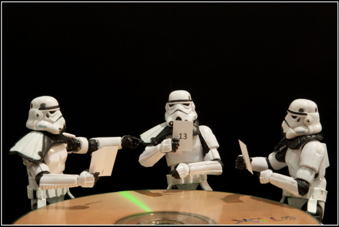
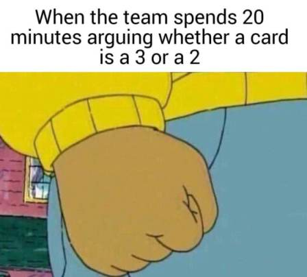
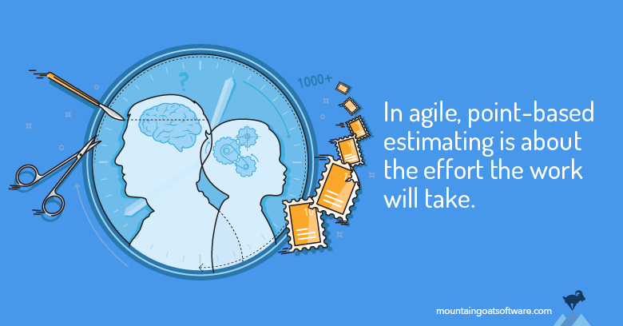
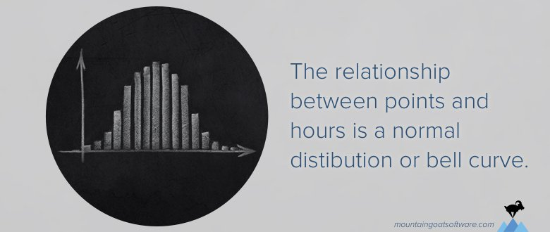

Jeśli [estymacja czasowa](/posts/estymacja-czasowa-godzinowa/) nie sprawdza się w naszym projekcie (co jest wielce prawdopodobne w przypadku oprogramowania), to możemy się posłużyć **estymacją relatywną**. Wielkość relatywna ma, w przeciwieństwie do estymaty bezwzględnej (najczęściej czasowej), ogromną przewagę, gdyż:

*   Minimalizuje błędy związane z przewidywaniem czasu poświęconego na złożone i skomplikowane zadania.
*   Ludzie, co dowiodły liczne badania naukowe (oraz być może praktyka czytelników), są słabi w szacowaniu.
*   Ludzie też, co również dowiodły badania naukowe, są lepsi w ustalaniu relatywnych, a nie bezwzględnych, estymacji.
*   Nie wiąże estymaty ze zobowiązaniem zespołowym (ang. commitment).

 

<small>Źródło: http://agilekarma.com/wpakar/uploads/2014/09/RemoteScrum.png</small>

# Metody relatywnych estymat

Metody estymacji relatywnych to:

* 🃏 Story points
* 👕 Estymaty koszulkowe S, M, L, XL, XXL
* ☕ Wielkości kubków Starbucksa (tall, grande, venti, trenta) - _tak przeczytałem, ale naprawdę ktoś to może stosować…?_
* 🔢 Proste sekwencje 1-5 lub 1-10 - _nie zalecane, o czym za chwilę_
* 🐘 Zoo points (zwierzęta) - od mrówki (lub mniejszego zwierzęcia) do słonia (lub [płetwala błękitnego](https://pl.wikipedia.org/wiki/P%C5%82etwal_b%C5%82%C4%99kitny))

# Story points

Najbardziej popularna metoda estymacji relatywnej to estymacja przy pomocy _story points,_ która ściśle związana jest z metodyką Scrum, choć sam Scrum nie jest do niej niezbędny.

Wartości story pointów to ciąg Fibonacciego:

> 0, 1, 2, 3, 5, 8, 13, 21, 34…

Niekiedy stosuje się wartości zbliżone do Fibonacciego. Zaokrąoglenie do 10 wyższych wartości pozwala na łatwiejsze zrozumienie, że chodzi nam o przybliżoną, a nie konkretną wartość:

> 0, 1, 2, 3, 5, 8, 13, 20, 40…
> 
> Dobrze, ale dlaczego zdecydowano się na wartości Fibonacciego?
> 
> Ciąg Fibonacciego (lub Fibonaccio-podobny) oddaje najlepiej fakt iż niepewność rośnie proporcjonalnie wraz z rozmiarem zadania. Im większe zadanie, tym większa niepewność co do estymacji. Pozwala też zniwelować jeden z błędów poznawczych - efekt skupienia, który, za Wikipedią "polega na przywiązaniu zbyt dużej wagi do jednego szczegółu, co zaburza racjonalną ocenę użyteczności rozważanego rozwiązania." Innymi słowy, estymując zadanie, nie zawracamy sobie głowy określeniem czy zadanie ma 19, 20, 21 lub 22 story pointy; o wiele prościej jesteśmy w stanie stwierdzić czy zadanie ma mieć 20 lub 40 story pointów. Lub, łatwiej jest określić że "to zadanie ma 8 punktów, a nie 5" zamiast: "to zadanie ma 8 punktów zamiast 7".

Alternatywnie, stosować można też liczby w systemie dwójkowym:

> 0, 1, 2, 4, 8, 16, 32, 64…
 
Spotyka się też wartości z gier karcianych:

> As, 2, 3, 5, 8, król.

Dodatkowo talie kart mogą zawierać wartości:

*   ½ – coś drobnego do zrobienia
*   ? – wartość nieznana
*   ∞ (symbol nieskończoności) – to zadanie nie może być zakończone
*   ☕ (symbol kawy) – potrzebuję przerwy

# Planowanie

Na czym polega estymacja przy pomocy story pointów. W uproszczeniu:

1.  Zespół gromadzi się na spotkaniu planowym.
2.  Uczestnikami estymacji jest zespół developerski, a zatem wliczone są w nim takie role jak programista, tester, itd.
3.  Zespół omawia szczegóły danej historyjki (User Story).
4.  Etap estymacji, w której każdy z członków wybiera swoją wartość, ale jeszcze jej nie odsłania.
5.  Po tym jak wszyscy wybiorą estymatę, każdy z uczestników pokazuje wybraną przez siebie wartość.
6.  Jeśli wszyscy są zgodni ze sobą, to historyjka dostaje przypisaną wartość estymacji.
7.  Jeśli nie, następuje dyskusja na temat różnic w estymatach. Po omówieniu różnic, wróć do estymacji (punkt 4.) i kolejnych punktów aż do momentu, kiedy wszyscy  wybiorą zgodną estymatę.

<small>Źródło: https://twitter.com/agile_memes/status/776356493155110913</small>

Tak, choć bardzo ogólnikowo, powinno wyglądać spotkanie planowania. Oczywiście, z pominięciem wielu szczegółów, jak np. Product i Sprint Backlog, rola Product Ownera i Scrum Mastera czy też podział na mniejsze historyjki.

Ogromną wartością w planowaniu ma punkt 7. w którym omawiane są różnice w estymatach. Pozwala to na lepsze zrozumienie samego zadania, ułożenie pytań, identyfikację problemów, ryzyk i zależności.

# 1 story point = ile godzin?

Kiedy estymujemy w jednostce czasu, próbujemy odpowiedzieć na pytanie: **Ile zajmie nam to czasu?** Kiedy natomiast estymujemy relatywnie, próbujemy odpowiedzieć na pytanie: **Jak to jest duże względem innego zadania?** Co kryje się pod pojęciem "jak duże"? Story pointy określają trzy różne aspekty podczas estymacji:

1.  **Złożoność problemu** (**complexity**).
2.  **Potrzebny wysiłek** (**effort**).
3.  **Niewiadome** (**doubt**).

Czy aby na pewno?

Definicja story pointa jest jednak mocno podzielona w światku agile'owym. I tak na przykład Mike Cohn twierdzi, że story point jest to wysiłek (effort), a nie złożoność (complexity) \[Cohn 2010\]. Za przykład podaje twa zadania - polizanie tysiąca znaczków oraz wykonanie prostej operacji mózgu. Złożoność dwóch zadań jest diametralnie różna, ale czas na zadanie będzie taki sam zakładając, że zespół składa się z siedmioletniego dziecka i chirurga. Nie zakładamy, że dziecko musi skończyć szkołę, studia medyczne oraz praktyki chirurgiczne. Zakładamy, że każdy ekspert domenowy wykonuje swoje zadanie, tj. chirurg - operację, dziecko - lizanie znaczków (choć w praktyce podział zadań wygląda różnie). Dla innych ekspertów agile'owych, sama złożoność problemu może (ale nie musi) mieć wpływ na wysiłek potrzebny w wykonanie zadania. A zatem wg nich złożoność jest składową estymacji w story pointach.

<small>Źródło: https://www.mountaingoatsoftware.com/blog/its-effort-not-complexity/</small>

Przyjąłem jednak definicję z jednej z [odpowiedzi na StackExchange](http://pm.stackexchange.com/questions/2765/why-use-story-points-instead-of-hours-for-estimating). Na te trzy wartości: złożoność, wysiłek i niewiadome, składają się następujące aspekty:

*   Poziom trudności.
*   Czas potrzebny na realizację zadania.
*   Obecna wiedza zespołu na temat zadania.
*   Obecna wiedza zespołu na temat działania systemu.
*   Zależności wewnętrzne i zewnętrzne.
*   Zakres założonej pracy.
*   Standardy jakości.
*   Nieznane czynniki i ryzyka, które mogą wpłynąć na zadanie.

Odpowiadając jednak na pytanie z nagłówka: _story point - ile to godzin..._ Bardzo często chcemy (lub ktoś chce tego od nas) jasnej odpowiedzi na to pytanie, np. "1 story point to średnio 6 godzin, 12 minut czasu pracy".

Istnieje zależność między story pointem, a czasem wykonania, ale należy wiedzieć, że:

*   Jest to zależność, a nie konkretna wartość.
*   Zależność ta jest inna dla każdego zespołu.
*   Zależność ta może być różna w różnych okresach trwania zespołu (przesunięcie w czasie - w dół lub w górę).

<small>Źródło: https://www.mountaingoatsoftware.com/blog/its-effort-not-complexity/</small>

Zależność między story pointem, a czasem wykonania to rozkład Gaussa \[Cohn 2014\]. Przy czym: rozkład jest różny dla różnych wartości, co oznacza że 3 story pointy nie muszą odpowiadać trzykrotnie większej średniej od jednego s.p. Niektóre jednopuntkowe zadania mogą okazać się większe niż dwupunktowe i na odwrót: te dwupunktowe mogą być krótsze niż jednopunktowe. Ekstremalnie rzadko jednak zdarza się, że zadanie 13-story pointowe będzie wynosiło tyle czasu co zadanie o estymacie 1 s.p.

# Podsumowanie

Estymaty relatywne i story pointy to gorący punkt na mapie agile'owej, który wywołał już niejedną bitwę. Czy jest to complexity, effort, doubt, risk, a może składowa niektórych lub też wszystkich tych aspektów... Zdania na ten temat są podzielone i myślę, że sama definicja nie jest najistotniejsza o ile zna się podstawowe cechy estymowania w story pointach. Najważniejsze jest zatem, aby wiedzieć że:

*   Im większe zadanie, tym trudniejsza i mniej dokładna jego estymata.
*   Z powyższego powodu warto, przed estymować, dzielić zadania na mniejsze.
*   Estymata relatywna to nie konkretna wartość czasowa, ale reprezentacja rozkładu normalnego.

# Źródła

*   [Why use story points instead of hours for estimating?](http://pm.stackexchange.com/questions/2765/why-use-story-points-instead-of-hours-for-estimating) Project Management Stack Exchange.
*   Vikaz Hazrati, ["Do Story Points Relate to Complexity or Time?"](https://www.infoq.com/news/2010/07/story-points-complexity-effort), InfoQ, 2010.
*   Mike Cohn, ["It’s Effort, Not Complexity"](https://www.mountaingoatsoftware.com/blog/its-effort-not-complexity/). Mountain Goat Software, 2010. 
*   Mike Cohn, ["How Many Hours Is a Story Point Worth?"](https://www.scrumalliance.org/community/spotlight/mike-cohn/june-2014/how-many-hours-is-a-story-point-worth) Scrum Alliance, 2014. 
*   [Agile Aliance Glossary: Relative Estimation](https://www.agilealliance.org/glossary/relative-estimation/). Agile Alliance.